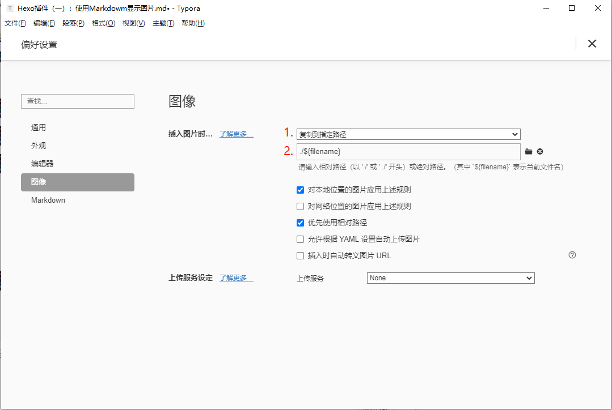

> `hexo`默认无法自动处理文章插入本地图片，需要通过扩展插件支持。

### 解决办法：

1.直接安装已经修改过的插件`hexo-asset-image`。

```bash
npm install https://github.com/7ym0n/hexo-asset-image --sa
```

2.设置Typora中图片储存路径



每次插入图片都可以将图片复制到当前目录下以标题命名的文件夹中

3.设置Hexo根目录下配置`_config.yml`里面的`post_asset_folder:false`这个选项设置为`true`。

自此即可顺利使用Markdown将图片插入文章中