## 一、初步搭建本地Hexo博客

## 1.安装

### 安装前提

搭建环境：Windows 10

- [Node.js](http://nodejs.org/) (Node.js 版本需不低于 8.10，建议使用 Node.js 10.0 及以上版本)
- [Git](http://git-scm.com/)

验证成功安装Node.js跟Git，通过查看版本号即可

```bash
node -v
```

```bash
npm-v
```

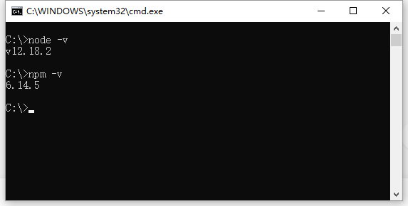


### 安装 Hexo

所有必备的应用程序安装完成后，即可使用 npm 安装 Hexo。

```bash
npm install -g hexo-cli
```


## 2.建站

### 生成项目

安装 Hexo 完成后，请执行下列命令，Hexo 将会在指定文件夹中新建所需要的文件。

```bash
hexo init <项目名称>
```

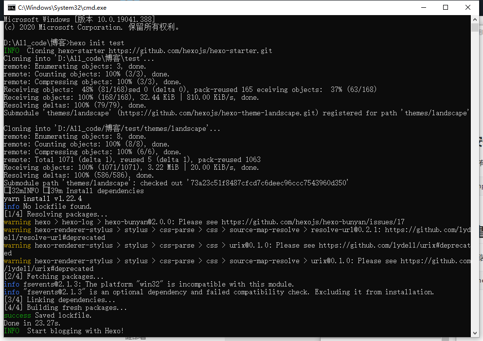

通过VScode软件打开初始化的博客（我这里命名为了test）

### 运行项目

运行服务：（hexo默认使用4000端口）

```bash
hexo s
```

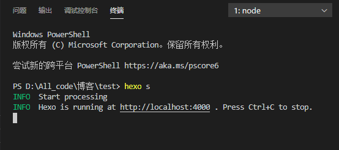

通过 http://localhost:4000 访问本地hexo服务

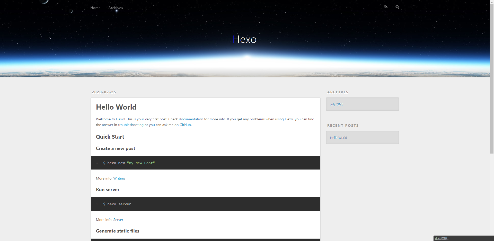

## 二、更换博客主题（hexo-theme-matery）

[hexo-theme-matery中文文档](https://github.com/blinkfox/hexo-theme-matery/blob/develop/README_CN.md)

### 1.下载

当你看到这里的时候，应该已经有一个自己的 [Hexo](https://hexo.io/zh-cn/) 博客了。如果还没有的话，不妨使用 Hexo 和 [Markdown](https://www.appinn.com/markdown/) 来写博客和文章。

点击 [这里](https://codeload.github.com/blinkfox/hexo-theme-matery/zip/master) 下载 `master` 分支的最新稳定版的代码，解压缩后，将 `hexo-theme-matery` 的文件夹复制到你 Hexo 的 `themes` 文件夹中即可。

当然你也可以在你的 `themes` 文件夹下使用 `Git clone` 命令来下载:

```bash
git clone https://github.com/blinkfox/hexo-theme-matery.git
```

### 2.更换主题

将博客文件夹下的配置文件`_config.yml`的主题`theme`改成：`hexo-theme-matery`

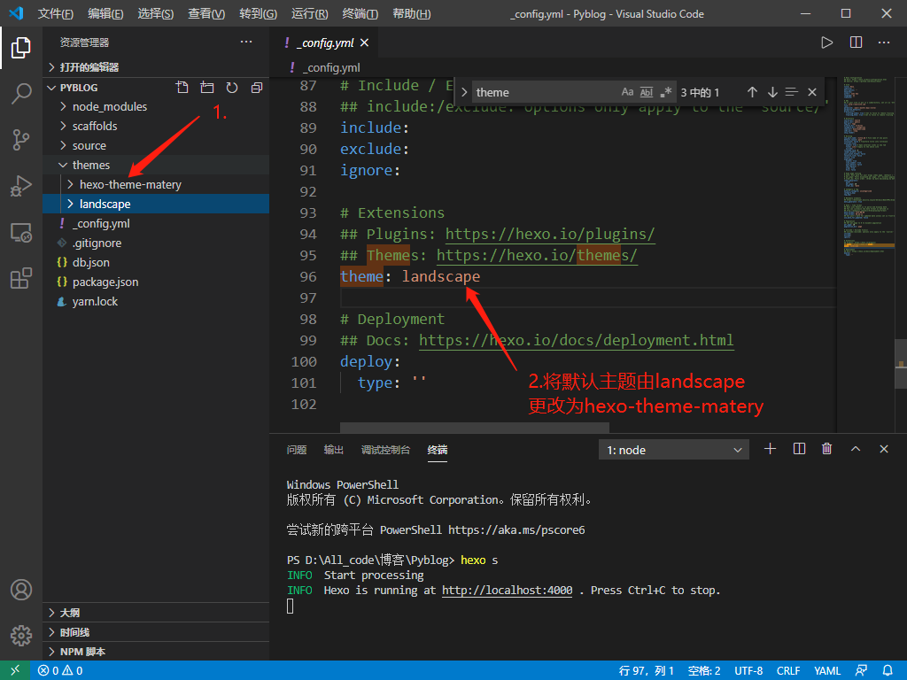

更换完成重新运行服务：


主题已成功修改

### 3.更换中文

将博客文件夹下的配置文件`_config.yml`的语言`language`改为`zh-CN`

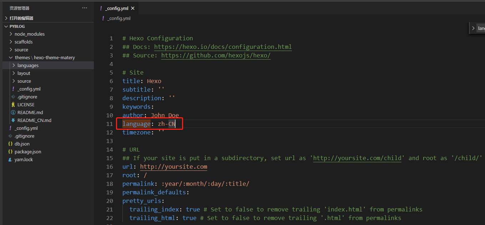

### 4.修改主题项中的配置

根据[hexo-theme-matery中文文档](https://github.com/blinkfox/hexo-theme-matery/blob/develop/README_CN.md)可自行添加功能项

#### 新建分类 categories 页

`categories` 页是用来展示所有分类的页面，如果在你的博客 `source` 目录下还没有 `categories/index.md` 文件，那么你就需要新建一个，命令如下：

```
hexo new page "categories"
```

编辑你刚刚新建的页面文件 `/source/categories/index.md`，至少需要以下内容：

```
---
title: categories
date: 2018-09-30 17:25:30
type: "categories"
layout: "categories"
---
```

#### 新建标签 tags 页

`tags` 页是用来展示所有标签的页面，如果在你的博客 `source` 目录下还没有 `tags/index.md` 文件，那么你就需要新建一个，命令如下：

```
hexo new page "tags"
```

编辑你刚刚新建的页面文件 `/source/tags/index.md`，至少需要以下内容：

```
---
title: tags
date: 2018-09-30 18:23:38
type: "tags"
layout: "tags"
---
```

#### 新建关于我 about 页

`about` 页是用来展示**关于我和我的博客**信息的页面，如果在你的博客 `source` 目录下还没有 `about/index.md` 文件，那么你就需要新建一个，命令如下：

```
hexo new page "about"
```

编辑你刚刚新建的页面文件 `/source/about/index.md`，至少需要以下内容：

```
---
title: about
date: 2018-09-30 17:25:30
type: "about"
layout: "about"
---
```

#### 新建友情链接 friends 页（可选的）

`friends` 页是用来展示**友情链接**信息的页面，如果在你的博客 `source` 目录下还没有 `friends/index.md` 文件，那么你就需要新建一个，命令如下：

```
hexo new page "friends"
```

编辑你刚刚新建的页面文件 `/source/friends/index.md`，至少需要以下内容：

```
---
title: friends
date: 2018-12-12 21:25:30
type: "friends"
layout: "friends"
---
```

同时，在你的博客 `source` 目录下新建 `_data` 目录，在 `_data` 目录中新建 `friends.json` 文件，文件内容如下所示：

```
[{
    "avatar": "http://image.luokangyuan.com/1_qq_27922023.jpg",
    "name": "码酱",
    "introduction": "我不是大佬，只是在追寻大佬的脚步",
    "url": "http://luokangyuan.com/",
    "title": "前去学习"
}, {
    "avatar": "http://image.luokangyuan.com/4027734.jpeg",
    "name": "闪烁之狐",
    "introduction": "编程界大佬，技术牛，人还特别好，不懂的都可以请教大佬",
    "url": "https://blinkfox.github.io/",
    "title": "前去学习"
}, {
    "avatar": "http://image.luokangyuan.com/avatar.jpg",
    "name": "ja_rome",
    "introduction": "平凡的脚步也可以走出伟大的行程",
    "url": "https://me.csdn.net/jlh912008548",
    "title": "前去学习"
}]
```

#### 新建 404 页

如果在你的博客 `source` 目录下还没有 `404.md` 文件，那么你就需要新建一个

编辑你刚刚新建的页面文件 `/source/404.md`，至少需要以下内容：

```
---
title: 404
date: 2018-09-30 17:25:30
type: "404"
layout: "404"
description: "Oops～，我崩溃了！找不到你想要的页面 :("
---
```

#### 代码高亮

由于 Hexo 自带的代码高亮主题显示不好看，所以主题中使用到了 [hexo-prism-plugin](https://github.com/ele828/hexo-prism-plugin) 的 Hexo 插件来做代码高亮，安装命令如下：

```
npm i -S hexo-prism-plugin
```

然后，修改 Hexo 根目录下 `_config.yml` 文件中 `highlight.enable` 的值为 `false`，并新增 `prism` 插件相关的配置，主要配置如下：

```
highlight:
  enable: false

prism_plugin:
  mode: 'preprocess'    # realtime/preprocess
  theme: 'tomorrow'
  line_number: false    # default false
  custom_css:
```

#### 搜索

本主题中还使用到了 [hexo-generator-search](https://github.com/wzpan/hexo-generator-search) 的 Hexo 插件来做内容搜索，安装命令如下：

```
npm install hexo-generator-search --save
```

在 Hexo 根目录下的 `_config.yml` 文件中，新增以下的配置项：

```
search:
  path: search.xml
  field: post
```

#### 中文链接转拼音（建议安装）

如果你的文章名称是中文的，那么 Hexo 默认生成的永久链接也会有中文，这样不利于 `SEO`，且 `gitment` 评论对中文链接也不支持。我们可以用 [hexo-permalink-pinyin](https://github.com/viko16/hexo-permalink-pinyin) Hexo 插件使在生成文章时生成中文拼音的永久链接。

安装命令如下：

```
npm i hexo-permalink-pinyin --save
```

在 Hexo 根目录下的 `_config.yml` 文件中，新增以下的配置项：

```
permalink_pinyin:
  enable: true
  separator: '-' # default: '-'
```

> **注**：除了此插件外，[hexo-abbrlink](https://github.com/rozbo/hexo-abbrlink) 插件也可以生成非中文的链接。

#### 文章字数统计插件（建议安装）

如果你想要在文章中显示文章字数、阅读时长信息，可以安装 [hexo-wordcount](https://github.com/willin/hexo-wordcount)插件。

安装命令如下：

```
npm i --save hexo-wordcount
```

然后只需在本主题下的 `_config.yml` 文件中，将各个文章字数相关的配置激活即可：

```
postInfo:
  date: true
  update: false
  wordCount: false # 设置文章字数统计为 true.
  totalCount: false # 设置站点文章总字数统计为 true.
  min2read: false # 阅读时长.
  readCount: false # 阅读次数.
```

#### 添加emoji表情支持（可选的）

本主题新增了对`emoji`表情的支持，使用到了 [hexo-filter-github-emojis](https://npm.taobao.org/package/hexo-filter-github-emojis) 的 Hexo 插件来支持 `emoji`表情的生成，把对应的`markdown emoji`语法（`::`,例如：`:smile:`）转变成会跳跃的`emoji`表情，安装命令如下：

```
npm install hexo-filter-github-emojis --save
```

在 Hexo 根目录下的 `_config.yml` 文件中，新增以下的配置项：

```
githubEmojis:
  enable: true
  className: github-emoji
  inject: true
  styles:
  customEmojis:
```

#### 添加 RSS 订阅支持（可选的）

本主题中还使用到了 [hexo-generator-feed](https://github.com/hexojs/hexo-generator-feed) 的 Hexo 插件来做 `RSS`，安装命令如下：

```
npm install hexo-generator-feed --save
```

在 Hexo 根目录下的 `_config.yml` 文件中，新增以下的配置项：

```
feed:
  type: atom
  path: atom.xml
  limit: 20
  hub:
  content:
  content_limit: 140
  content_limit_delim: ' '
  order_by: -date
```

执行 `hexo clean && hexo g` 重新生成博客文件，然后在 `public` 文件夹中即可看到 `atom.xml` 文件，说明你已经安装成功了。

## 三、Github上搭建博客

### 1.新建仓库

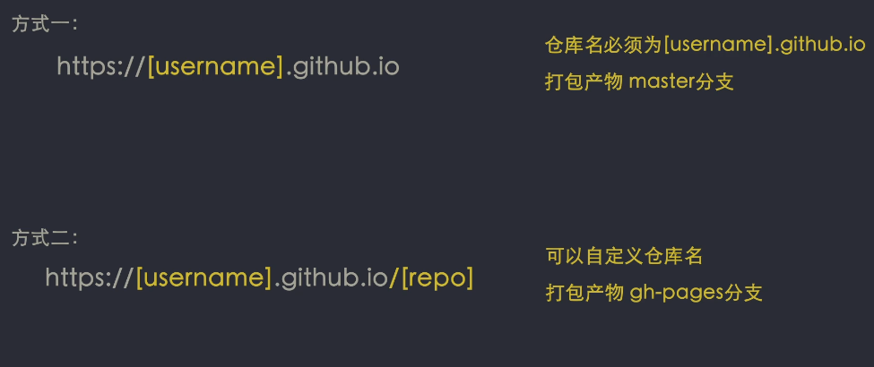

### 2.初始化仓库

##### ①初始化本地仓库

```bash
git init
```

##### ②添加一个远程git地址

```bash
git remote add origin <远程仓库地址>
```


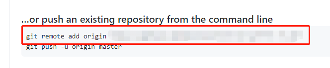

### 3.安装hexo-depoyler-git依赖

```bash
yarn add hexo-deployer-git
```

### 4.修改部署相关的配置：

修改 Hexo 根目录下 `_config.yml` 文件中`deploy`的相关属性：

```
deploy:
  type: git
  repo: <仓库地址>
  branch: master
```

### 5.部署代码

```
npm run deploy
```

查看站点是否已被部署成功打开github仓库中`setting`选项，拉下去找到`GitHub Pages`

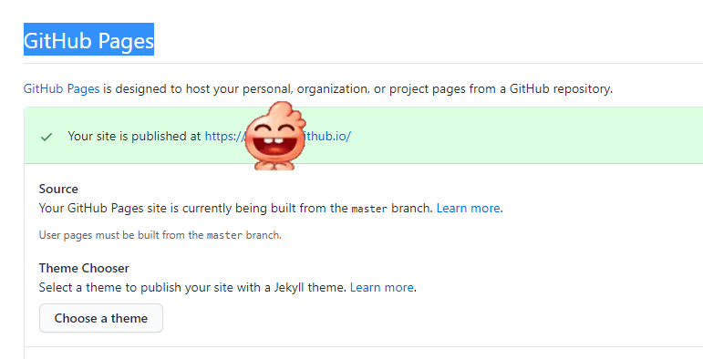

打开站点查看


## 四、实现Github自动化部署

由于上面操作中master分支已被占用，我们要把源代码提交到另外一个分支上

### 1.首先commit本地代码

```bash
git add .
git commit -m 'feat:blog init'
```

### 2.切换分支 myblog

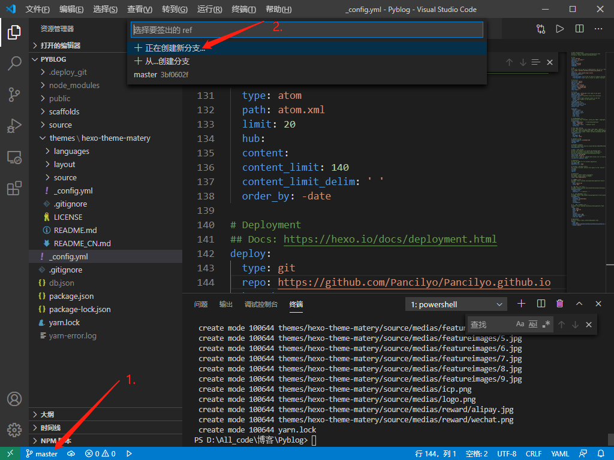

### 3.将myblog分支push到github中

```bash
git push --set-upstream origin myblog
```

### 4.配置github actions

在hexo根目录下创建文件`deploy.yml`，文件路径为：`.github/workflows/deploy.yml`

<details>
    <summary>文件内容</summary>


```yaml
name: Build and Deploy
on: [push]
jobs:
  build-and-deploy:
    runs-on: ubuntu-latest
    steps:
      - name: Checkout 🛎️
        uses: actions/checkout@v2 # If you're using actions/checkout@v2 you must set persist-credentials to false in most cases for the deployment to work correctly.
        with:
          persist-credentials: false
   - name: Install and Build 🔧 # This example project is built using npm and outputs the result to the 'build' folder. Replace with the commands required to build your project, or remove this step entirely if your site is pre-built.
    run: |
      npm install
      npm run build
    env:
      CI: false

  - name: Deploy 🚀
    uses: JamesIves/github-pages-deploy-action@releases/v3
    with:
      GITHUB_TOKEN: ${{ secrets.GITHUB_TOKEN }}
      BRANCH: master # The branch the action should deploy to.
      FOLDER: public # The folder the action should deploy.
```
</details>

提交到仓库中：

```bash
git add .
git commit -m 'feat:添加github action'
git push
```

测试一下github action是否生效，修改一下文章内容并提交

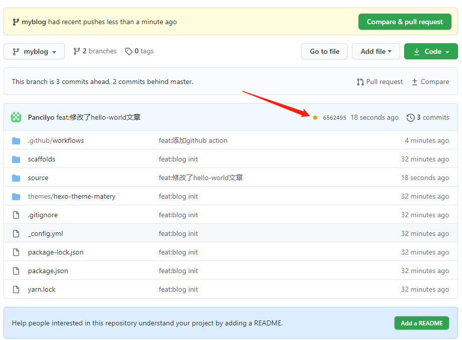

点进去查看：

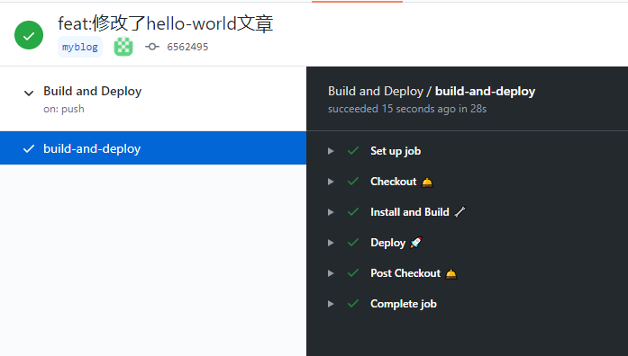

自此自动化部署已完成。

文章参考自：

[【干货】Luke教你20分钟快速搭建个人博客系列(hexo篇) | 自动化部署在线编辑统统搞定 | 前端必会！](https://www.bilibili.com/video/BV1dt4y1Q7UE?t=711)